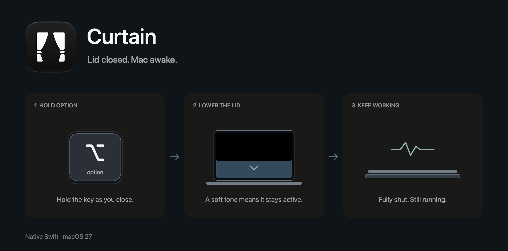

# Curtain



A small native Swift menu bar app for macOS 27. Hold Option and close your MacBook to keep it awake with the lid shut. Choose a sliding black curtain or a perspective effect that follows the lid. No external packages. This is a source-only project: build and sign your own copy.

> [!WARNING]
> This application was built entirely with AI. Use it at your own risk.

## Use

- Open Curtain and approve the one-time sleep helper installation. If setup was cancelled, choose Enable Curtain to retry.
- With the lid open, hold either Option key and lower it. A quiet tone confirms that Curtain has reached the activation angle and will stay active.
- Release Option after the tone and close the lid completely. A second sound confirms full closure. Your Mac keeps working.
- Open the lid to dismiss the curtain and restore normal sleep. With the default settings, activation is at 27° and dismissal is above 32°.
- Releasing Option before activation cancels. Escape dismisses the curtain. Release Option and reopen the lid before starting another gesture.

The menu bar contains status, Enable/Disable Curtain, Settings, and Quit. Curtain remembers whether it was enabled. Enable Open at Login in Settings to start it automatically after signing in.

## Settings

Choose Sliding curtain for the original black overlay or Perspective for a desktop snapshot that changes perspective and becomes blurrier as the lid closes. Perspective needs Screen Recording permission. Snapshots stay in memory, are discarded when the lid shuts or the gesture ends, and are never saved. Without permission, Curtain uses the sliding style.

Adjust the activation angle with the slider, or position the lid and choose Use Current Angle. Larger angles activate sooner. Start with the lid at least 5° above your chosen angle; opening past that point dismisses the curtain.

Sleep at low battery is enabled at 20% by default. Choose a cutoff from 10–100%, or turn it off. On battery power, reaching the cutoff stops Curtain and puts your Mac to sleep. The cutoff does not apply while plugged in.

Play sound effects controls both the activation tone and the fully closed sound. The How to Use Curtain tab has the gesture instructions.

## Build and sign

Requires a MacBook with a supported lid-angle sensor, macOS 27, Xcode 27, Python 3, and OpenSSL available in your shell. Open Xcode once to finish its setup, then run from the cloned repository:

```sh
export DEVELOPER_DIR=/Applications/Xcode.app/Contents/Developer
./scripts/run.sh
```

This builds, signs, installs into `/Applications/Curtain.app`, and launches it. Use `./scripts/build.sh` to build and sign without installing.

Signing is automatic. The first build creates your own self-signed development certificate in a private keychain under `~/Library/Application Support/Curtain/Signing`. Later builds reuse it so the installed sleep helper recognizes the app. Keep that directory private and intact. No paid Apple Developer account or notarization is needed for this local build. The scripts do not change system certificate trust or your default keychain.

The sleep helper needs administrator approval once. Ordinary app rebuilds and restarts reuse it without asking for your password again.

## Behavior and limits

The lid-angle sensor uses undocumented hardware behavior and is not available on every MacBook. If the sensor stops responding for three seconds, Curtain cancels the session.

A root-owned helper manages lid-close sleep prevention and releases it if the app disconnects. Use one lid-control app at a time: another app changing the same power setting can interfere with sleep and the battery cutoff.

The overlay covers connected screens, including ordinary full-screen apps. It does not stop background apps from rendering, turn off the backlight, or lock your Mac. macOS controls panel power when the lid is fully shut.

See [development notes](docs/DEVELOPMENT.md) for helper behavior, installation paths, removal instructions, and banner generation.

## Why can't I just download the binary?

Because I'm not paying Apple $100 a year for this shit. That's what Developer ID signing and notarization would cost, even for a free app. I could ship an unnotarized binary, but you'd still have to deal with macOS security warnings.

Once the build tools above are installed, run `./scripts/run.sh` and you have the app ready. You also get all the source code, so you can see what it does and change whatever you want.
